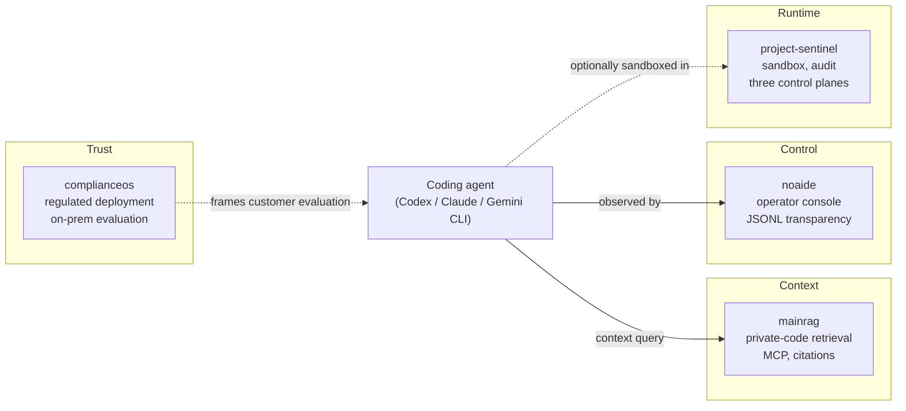

# silentspike

Software for regulated organizations and the public sector.
Focus areas: AI tooling, agent supervision, and on-premise deployment.

## How these repos relate

The four AI-coding repos cover one operational pattern:

- **mainrag** answers *what context does the agent need?*
- **noaide** answers *what is the agent doing right now?*
- **project-sentinel** answers *what runtime boundaries enforce safety?*
- **complianceos** answers *how does a regulated customer evaluate this?*

[netbird-machine-tunnel](https://github.com/silentspike/netbird-machine-tunnel) sits outside the AI-coding stack — it is a real-product fork (NetBird) maintained against upstream as a separate engineering-discipline signal.

## Where to start

| If you want to see... | Read first |
|---|---|
| AI-coding-agent supervision and audit | [noaide](https://github.com/silentspike/noaide) — operator console, 5-minute supervision demo |
| Private-code retrieval over MCP for coding agents | [mainrag](https://github.com/silentspike/mainrag) — 3-minute MCP demo, cited search |
| Runtime governance, sandbox isolation, breakout test evidence | [project-sentinel](https://github.com/silentspike/project-sentinel) — TOGAF v22.1 architecture, 9/9 sandbox breakout tests |
| Regulated AI deployment, ROI framing, EULA evaluation flow | [complianceos](https://github.com/silentspike/complianceos) — KRITIS / NIS2 / BSI audit platform |
| Real-product fork maintenance, Windows AD pre-login VPN | [netbird-machine-tunnel](https://github.com/silentspike/netbird-machine-tunnel) — upstream-synced NetBird fork |

## AI Coding Tools (Open Source)

Tools around the operational use of coding agents in engineering teams — context, operator control, and runtime boundaries.

- **[noaide](https://github.com/silentspike/noaide)** — Browser-based real-time IDE and operator console for AI coding agents
- **[mainrag](https://github.com/silentspike/mainrag)** — Self-hosted retrieval and context engine for private code and knowledge bases, with MCP server
- **[project-sentinel](https://github.com/silentspike/project-sentinel)** — Reference testbed for agent runtime governance, sandbox isolation, and event sourcing

## Active Products

### [ComplianceOS](https://github.com/silentspike/complianceos)
AI-assisted on-premise compliance audit platform for ISO 27001, ISO 22301,
NIS2, BSI IT-Grundschutz, and other standards. Proprietary software with
a 90-day evaluation pilot.

[Request evaluation](https://github.com/silentspike/complianceos/issues/new?template=evaluation_request.yml)

## Production Engineering / Maintenance

Real product work on external codebases with continuous upstream maintenance.

- **[netbird-machine-tunnel](https://github.com/silentspike/netbird-machine-tunnel)** — NetBird fork with Windows pre-login machine tunnel (AD/Kerberos via mTLS), continuously synchronized against upstream

## Other Projects

- **[worldsynth](https://github.com/silentspike/worldsynth)** — Professional multi-engine synthesizer

## Contact

See individual repositories for evaluation and support.
